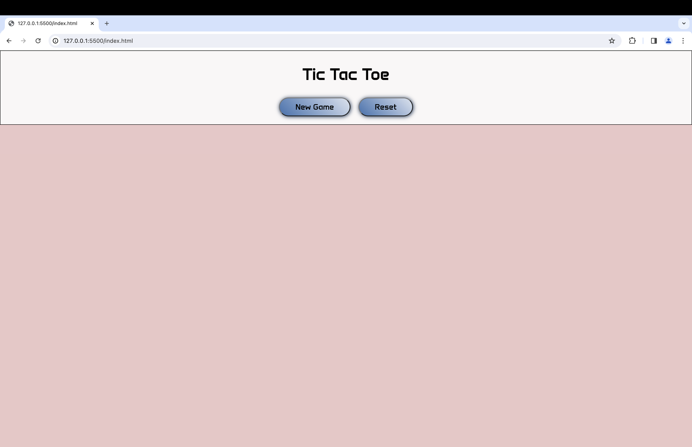
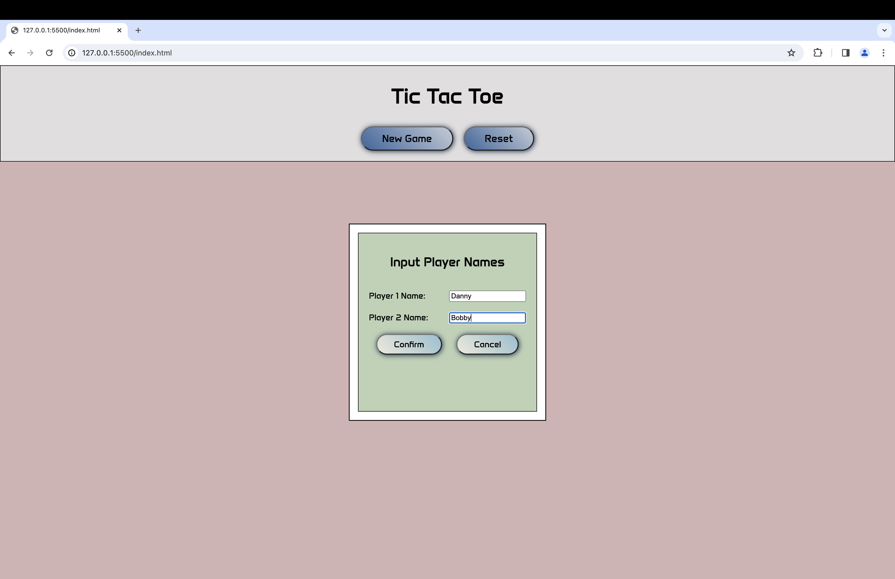
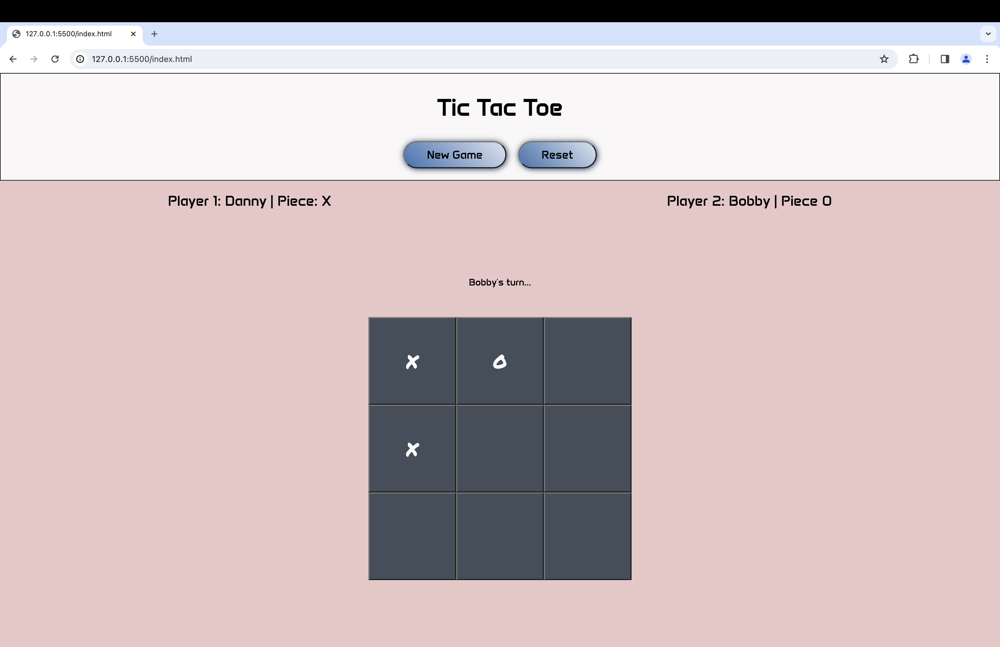
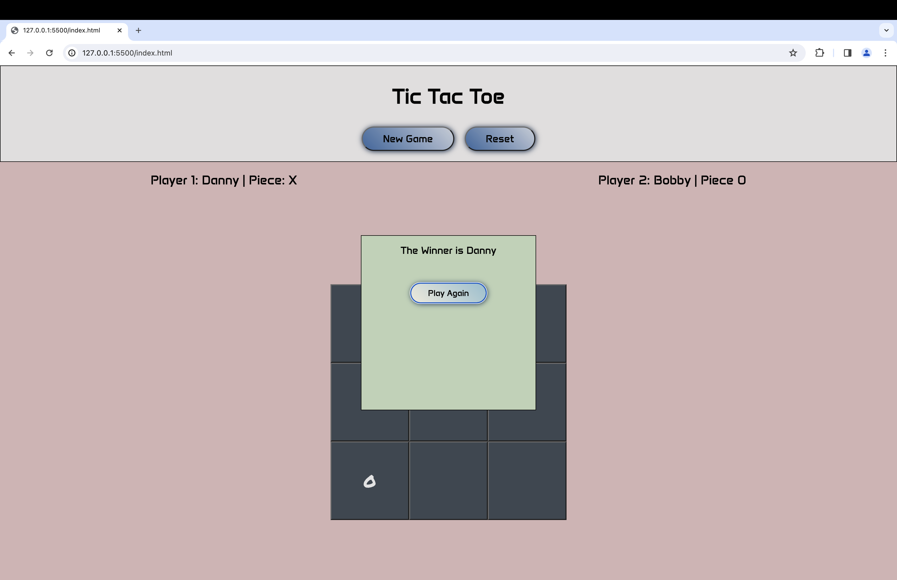

# Tic Tac Toe!

## Live Demo HERE: [Tic Tac Toe] (https://danny-lau1.github.io/tic-tac-toe/)

### I built a tic-tac-toe game between two players using vanilla JS, html, and CSS

#### Things I Learned

1. Implementing the module pattern and IIFE to promote encapsulation and private variables. 
2. Keeping separation of concerns by creating separate modules for the game board, game logic, and screen controller modules.

#### Initial Render of Game

#### Adding Players

#### Playing A Game

#### Announcing A Winner!

